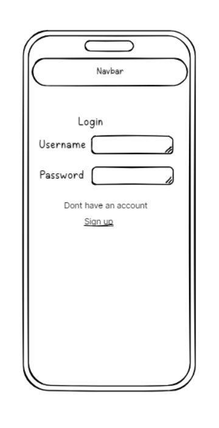
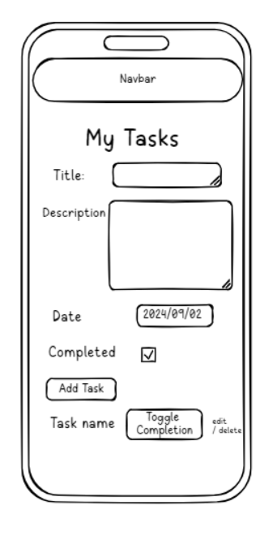
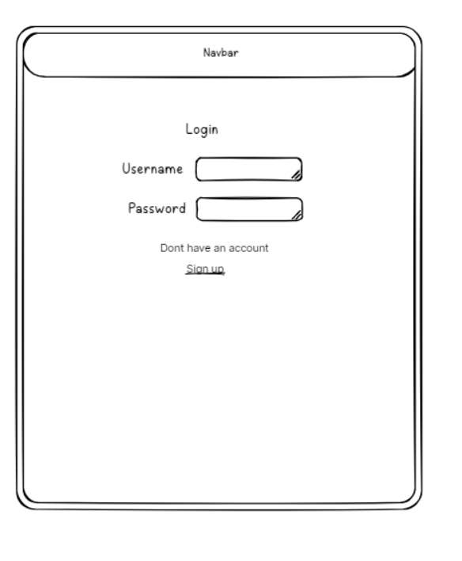
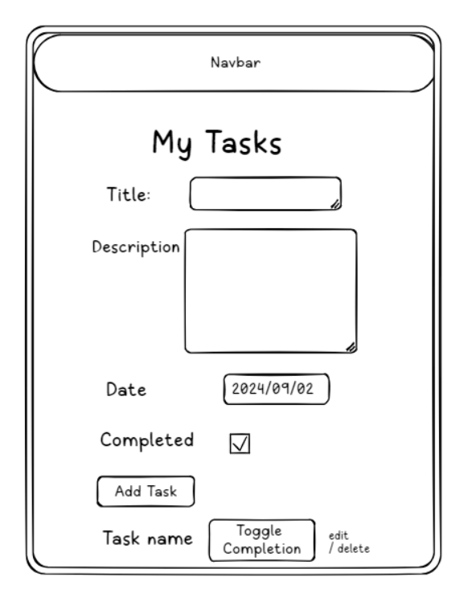
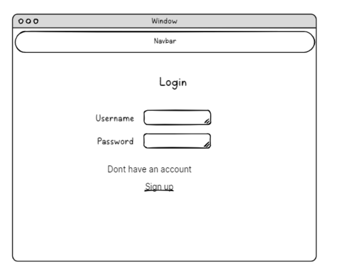
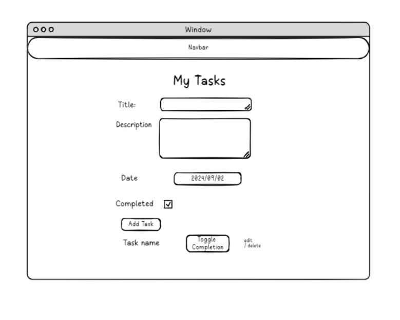

# Task Manager

## Project Rationale

- This project uses a simple, clear and user friendly web application To-Do List built with Django and Python. It allows users to customise their own tasks by creating, editing deleting, and marking tasks as completed. Each user has their own task list and can manage tasks efficiently.

## UX

- This project was designed with a clear focus on simplicity, usability and accessibility so that users can interact with the task manager quickly and without confusion. all forms use clear labels and straightforward layouts, making them easy to understand. The interface is clean n minimal, with good colour contrast and readable text sizes. bootstrap ensures the layout is fully responsive allowing the app to work smothly across desktops, tablets, and mobile devices. navigation is consistent across all pages, with clearly named buttons and links that make it easy for users to move between creating, editing, viewing and deleting tasks. Additionally, form submissions and task actions provide clear visual feedbak, helping users understand the result of there interactions. 

### Target Audience

- The Task Manager App is intended for anyone who wants to manage personal tasks and stay organized.Anyone who is overstressed, has mind clutter or has many tasks can use this app to become more organsied, clear mind clutter and manage tasks efficiently.

### How to operate the Task Manager

- To use the Task Manager, first sign up if you don’t have an account, then log in with your username and password. On the main page, create new tasks by entering a title, optional description, and due date, and click Add Task. Your tasks will appear in a list where you can edit them to update details, delete tasks permanently, or toggle their completion status directly. The navbar allows you to log out safely when finished. All actions are linked to your account, ensuring only you can view and manage your tasks.

## User Stories

Click here to view the User Stories 

- As a first time user, I want to easily create, view, and manage my tasks so that I can organize and track my progress.

- As a user, I want to assign due dates to my tasks so that I can prioritize my work and plan better.

- As a user, I want to securely log out of my account so that my tasks and account information are protected when I am done.

- As a mobile user, I want the task manager to work smoothly on my phone or tablet so that I can manage my tasks on the go without issues.

- As a user, I want to delete tasks that are no longer needed so that my task list remains focused and manageable.

- As a user, I want to mark tasks as complete so that I can track which tasks are finished.

- As a user, I want to ensure my tasks are stored securely so that my data is safe from unauthorized access.

## Wireframes

Click here to view the Wireframes 

### Mobile Wireframes

### Tablet Wireframes

### Desktop Wireframes

## Features

### Existing Features

Click here to view the the Existing Features 

**User Signup**

- Users can create an account using a simple signup form. Each user is able to create, edit, delete and update their own tasks.

**User Login**

- Users with an account can securely log in using Django’s built-in authentication system and are taken straight to their personal task list.

**User Logout**

- Users can log out at any time and are redirected back to the login page.

**Create Tasks**

- Users can add new tasks using a form that includes fields for the task title, description, and optionally a due date. Each task is linked to the user who created it.

**Due Date Feature**

- Users can assign a due date and time when creating or editing a task. This helps them organise tasks more effectively by knowing when something is expected to be completed.

**View Tasks**

- All tasks belonging to the logged-in user are displayed clearly on the main task page so they can keep track of what needs to be done.

**Edit Tasks**

- Users can edit a task’s title, description, due date, and completion status. This allows changes without needing to create new tasks.

**Delete Tasks**

- Users can permanently remove tasks from their list with one click, keeping their task list tidy.

**Responsive Layout**

- The interface uses Bootstrap, ensuring the layout adjusts smoothly across mobile, tablet, and desktop screens.

**Toggle Task Completion**

- Users can quickly switch any task between “Completed” and “Not Completed” directly from the task list using a simple button.

**Task Buttons**

- Clear action buttons are included for “Add Task”, “Edit”, “Delete”, and “Toggle Completion”, making the interface easy to use and navigate.

**Navigation Bar**

- A Bootstrap-styled navigation bar appears at the top of each page. It includes links to the task list, login, logout and a welcome message when the user is logged in.

### Future Features

Click here to view the Future Features

- **Priority Levels for Tasks**  
  Add an option to set priority levels for tasks (e.g., low, medium, high). This would allow users to better organize tasks based on their urgency and importance, and provide visual indicators (like color coding) for quick identification.

- **Task Categories or Tags**  
  Allow users to categorize tasks by creating custom tags or categories. This would let users group similar tasks (e.g., Work, Personal, Shopping, etc.), making it easier to filter and view tasks by category.

- **Search Functionality**  
  Implement a search bar that allows users to quickly search through their task list by title, due date, or status (completed/incomplete). This would help users manage large task lists more efficiently.

## Technologies Used

Click here to view the Technologies Used

| **Technology**                                                                  | **Purpose**                                                                              |
| ------------------------------------------------------------------------------- | ---------------------------------------------------------------------------------------- |
| [**HTML**](https://developer.mozilla.org/en-US/docs/Web/HTML)                   | For structuring the content of the web pages.                                            |
| [**CSS**](https://developer.mozilla.org/en-US/docs/Web/CSS)                     | For styling the appearance of the site.                                                  |
| [**JavaScript**](https://developer.mozilla.org/en-US/docs/Web/JavaScript)       | For Bootstrap Navbar interactivity.                                                      |
| [**Bootstrap 4**](https://getbootstrap.com/docs/4.0/)                           | For responsive layout and the Navbar.                                                    |
| [**Python 3**](https://www.python.org/)                                         | Programming language used to write the backend logic.                                    |
| [**pip**](https://pip.pypa.io/en/stable/)                                       | Python package manager used to install dependencies.                                     |
| [**venv**](https://docs.python.org/3/library/venv.html)                         | Python virtual environment used to isolate project dependencies.                         |
| [**Django 5**](https://www.djangoproject.com/)                                  | Web framework used for server-side logic, user authentication, and CRUD operations.      |
| [**SQLite**](https://www.sqlite.org/)                                           | Database used to store tasks and user information.                                       |
| [**Visual Studio Code**](https://code.visualstudio.com/)                        | Code editor used to build and manage the project.                                        |
| [**Git**](https://git-scm.com/)                                                 | Version control tool used to track changes in the project.                               |
| [**GitHub**](https://github.com/)                                               | Hosting platform used to store the project repository.                                   |
| [**Google Chrome DevTools**](https://developer.chrome.com/docs/devtools/)       | Used for debugging, inspecting elements, and testing CSS.                                |
| [**Heroku (or Render)**](https://www.heroku.com/)                               | Cloud platform used for deploying the application.                                       |
| [**Frame0**](https://frame0.app/)                                               | Tool used for wireframing and designing the user interface before development.           |
| [**Grammarly**](https://www.grammarly.com/)                                     | Used for proofreading and ensuring grammatical correctness in the project documentation. |
| [**Markdown Table Generator**](https://www.tablesgenerator.com/markdown_tables) | Tool for easily generating markdown tables in a visual format.                           |

All other code was written by Hanna Mussa.

## Code Attribution

Click here to view the Code Attribution

| **Source**                                                                                                               | **Purpose**                                                                                                                 |
| ------------------------------------------------------------------------------------------------------------------------ | --------------------------------------------------------------------------------------------------------------------------- |
| [**Django Official Documentation**](https://docs.djangoproject.com/en/5.2/)                                              | Helped understand Django forms, models, and authentication system.                                                          |
| [**YouTube: Django To-Do List Tutorial**](https://www.youtube.com/watch?v=6Jf8-PbHoLM)                                   | Provided step-by-step guidance on setting up CRUD functionality with Django, demonstrating how to create and display tasks. |
| [**MDN Django Tutorials**](https://developer.mozilla.org/en-US/docs/Learn_web_development/Extensions/Server-side/Django) | Explained Django concepts, useful for understanding form handling and template rendering.                                   |
| [**W3Schools Django Guide**](https://www.w3schools.com/django/)                                                          | Used as a quick reference for syntax and template examples.                                                                 |
| [**YouTube: Bootstrap Navbar Implementation**](https://www.youtube.com/watch?v=H_cWdD-aXCQ&t=295s)                       | Showed how to implement a responsive navbar, which was adapted for the project’s layout.                                    |
| [**YouTube: Django Authentication**](https://www.youtube.com/watch?v=kDAnnEhb4_I)                                        | Explained login, logout, and signup flows, helping integrate user authentication.                                           |

## Database and Relationship

Click here to view the the Database and Relationship
 

- This project uses a relational database to store task data for each user. The database is managed by Django's ORM (Object-Relational Mapping), which allows us to interact with the database using Python objects rather than writing raw SQL queries. This approach facilitates the process and makes it easier with the built-in shortcuts provided by Django.

- The relational database enables information and tables to be linked together. For example, many tasks can belong to one user.

- There are two main models in the database: `User` and `Task`.

- The `User` model is an inbuilt model in Django that handles authentication and user accounts. Each user has a unique username and password, and the `User` model is used for authentication in the application.

- The `Task` model represents a task created by the user. Each task has the following fields: `user`, `title`, `description`, `due_date`, and `completed`. Multiple fields are used to link information between the two models and establish a relationship between them.

  The `ForeignKey` field is used to indicate that each user has their own specific tasks. This enables users to have individual to-do lists, rather than sharing a single public to-do list.

  - The `title` is a `CharField` used to name or describe the task.

  - The `description` is an optional field that allows the user to add more information about their task. It is intended for longer text.

  - The `due_date` field represents and stores the date and time by which the task should be completed. This field is also optional.

  - The `completed` field is a `BooleanField` that is displayed as a checkbox. When ticked, it indicates the task has been completed (`True`), and when unticked, it indicates the task is incomplete (`False`). This field is also optional.

### Setting Up the Database

- Django uses migrations to create and manage tables in the database. To apply migrations, run the following commands in the terminal:

1. `python manage.py makemigrations`  
   This generates migration files based on changes to your models.

2. `python manage.py migrate`  
   This applies the migrations and creates the necessary tables in the database.

### Testing the Migrations

- To test if the migrations have been applied correctly, log in to Django's admin panel and check if your models have been successfully created as tables.

## Testing

To view the testing carried out, please refer to the [TESTING.md](TESTING.md) file.

## Local Deployment

Click here to view the Local Deployment 

1. Clone the repository by typing in the terminal:
   `git clone https://github.com/HannaMussa/task_manager.git
cd task_manager`
2. Create a virtual environment and activate it:
   `python -m venv venv
venv\Scripts\activate` (Windows)
   `source venv/bin/activate` (Mac/Linux)
3. Install the dependencies:
   `pip install -r requirements.txt`
4. Apply the database migrations:
   `python manage.py migrate`
5. Run the server:
   `python manage.py runserver`
6. Open your browser and click the link displayed in the terminal to access the app.

## Deployment

## Deployment

The Task Manager app is deployed on [Render](https://render.com). The repo is connected to Render, which automatically installs all the stuff from `requirements.txt` and starts the app using the default Python web service settings. I set the environment variables, like `SECRET_KEY` and `DEBUG`, in Render to keep it secure. You can check out the live site here: [Live App Link](https://task-manager-vhj1.onrender.com). It should work fine, though sometimes it takes a bit to load.

## Forking

Click here to view the Forking 

Forking allows you to create a personal copy of the project:

1. Navigate to the task_manager
   repository.

2. Click Fork, then click create a new fork.

3. Name your forked repository and click Create fork.

The forked repository will now appear in your GitHub account.

### Acknowledgements

I am grateful to my tutor, Robert Thompson, and my mentor, Richard Wells, for their continued support and guidance during this project.

https://docs.djangoproject.com/en/5.0/howto/deployment/checklist/#secret-key

https://docs.djangoproject.com/en/5.0/ref/settings/#allowed-hosts

https://docs.djangoproject.com/en/5.0/howto/static-files/deployment/

helped set up secret key settings.py